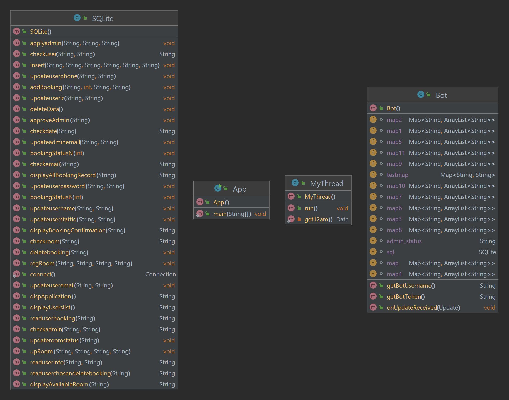

## Requirements for Group Project
[Read the instruction](https://github.com/STIW3054-A221/class-activity-soc/blob/main/GroupProject.md)

## Group Info:

| No. | Photo                                       | Name                  | Matric Number | Semester | Phone Number |
| ------------- |---------------------------------------------|-----------------------|---------------|----------|--------------|
|1.|  | Loh Siew Chin         | 278723        | 5        | 017-4918235  |
|2.|     | Teoh Zhi Yi           | 278645        | 5        | 018-2014036  |
|3.|   | Ooi Shi Koon          | 277290        | 5        | 017-5774491  |
|4.|      | Fanny Tang Tung Huong | 278366        | 5        | 011-51103470 |
|5.|   | Lim Zhun Wei          | 279632        | 5        | 014-7461218  |

## Title of your application

  Koko Room Booking System  
 

## Introduction

Nowadays, people are demanding the simplification of tasks due to technological advances. People prefer to complete
tasks online, such as online shopping or online booking. Therefore, several Telegram bots are born to fulfill people's
demands. Telegram bots are a program that can be embedded in Telegram chats or public channels to perform specific
tasks. They can provide personalised keyboards, create memes on demand, accept payments and serve as a digital
storefront.

The Telegram bot developed in this project is separated into two parts which are user part and admin part. This telegram
bot is built purposely to let users book the meeting room anytime and wherever
they are. Besides, the admin can also manage the room and approve new admin by using this Telegram bot.

For the user part, the user must login to the account first to start booking a room. If the user does not have n
account, the user can register an account through the bot. After login, the bot will show several options, such as "
Update Personal Info", "Book a Room", "Update Booking", "Delete Booking" and "Apply School Admin". The user can choose
the option they want by replying to the bot, and the bot will continue to let the user key in some details needed for
the process.

For the admin part, the admin must login first only to continue to access the admin menu. The bot will show several menu
option such as "Register New Room", "Update Room Details", "3: Display Booking Users List" and "Display Admin
Application" after the admin successfully login. The admin can approve the school admin application and manage rooms by
replying to the bot with some details needed through this bot. This bot can make the room booking process more
effective.

## Flow Diagram of the requirements

## User manual for installing your application on Heroku Server

## User manual/guideline for testing the system

## Result/Output (Screenshot of the output)
User
1. Register

   
   
   
   
   
2. Login

   
   

3. Update Personal Info

   
   
   
   

4. Booking

   
   
   
   
   

5. Update Booking

   
   
   
   

   If the date enter is not available to book yet or the time slot is full on the date.

   
   
6. Delete Booking

   
   
   
   
7. Apply Admin

   
   
   

Admin
1. Login

   
   
   
   

2. Register room

   
   
   
   
   
3. Update room

   
   
   
   
   
   
4. Display booking user list

5. Approve admin

## Use Case Diagram

## UML Class Diagram

## Database Design

## Youtube Presentation

 https://youtu.be/oqIq5wxL1kY 

 

## References (Not less than 20)

1. B., R. (2022, December 14). _What is MySQL: MySQL Explained for Beginners._
   Hostinger. https://www.hostinger.com/tutorials/what-is-mysql
2. Carnes, B. (2020, January 1). _Basic SQL Commands - The List of Database Queries and Statements You Should Know._
   freeCodeCamp. https://www.freecodecamp.org/news/basic-sql-commands/
3. _Connect To The SQLite Database Using SQLite JDBC Driver._ (2021, April 10). SQLite
   Tutorial. https://www.sqlitetutorial.net/sqlite-java/sqlite-jdbc-driver/
4. _HashMap in Java - javatpoint._ (n.d.). Javatpoint. https://www.javatpoint.com/java-hashmap
5. _HashMap Java Tutorial._ (2019, May 23). YouTube. https://www.youtube.com/watch?v=70qy6_gw1Hc
6. _How to create Telegram Bot in Java._ (2021, November 11). YouTube. https://www.youtube.com/watch?v=XjOnp8TVNSQ
7. _Java HashMap._ (n.d.). W3Schools. https://www.w3schools.com/java/java_hashmap.asp
8. _Java HashMap (With Examples)._ (n.d.). Programiz. https://www.programiz.com/java-programming/hashmap
9. _Java Program to Retrieve Contents of a Table Using JDBC connection._ (2022, April 25).
   GeeksforGeeks. https://www.geeksforgeeks.org/java-program-to-retrieve-contents-of-a-table-using-jdbc-connection/
10. _Java SQLite Example - javatpoint. (n.d.). Javatpoint._ https://www.javatpoint.com/java-sqlite
11. Lenka, C. (2022, September 6). _HashMap in Java with Examples._
    GeeksforGeeks. https://www.geeksforgeeks.org/java-util-hashmap-in-java-with-examples/
12. _Map and HashMap in Java - Full Tutorial._ (2021, June 14). YouTube. https://www.youtube.com/watch?v=H62Jfv1DJlU
13. Newman, L. H. (2019, January 17). _Be Careful Using Bots on Telegram._
    WIRED. https://www.wired.com/story/telegram-bots-tls-encryption/
14. Sidborn, J., Wiberg, D., Öhman, J., Öhman, & P. (2020). Room Booking System - Online Room Booking
    Software. https://www.roombookingsystem.co.uk/
15. _SQLite INNER JOIN with Examples._ (n.d.). SQLite Tutorial. https://www.sqlitetutorial.net/sqlite-inner-join/
16. _SQLite - Java._ (n.d.). Tutorialspoint. https://www.tutorialspoint.com/sqlite/sqlite_java.htm
17. _SQLite Java: Select Data._ (n.d.). SQLite Tutorial. https://www.sqlitetutorial.net/sqlite-java/select/
18. _Telegram Bot - Process response from user based on last bot question._ (2019, December 15). Stack
    Overflow. https://stackoverflow.com/questions/59341135/telegram-bot-process-response-from-user-based-on-last-bot-question
19. Vaghela V. (2020, December 21). _How to create a Telegram bot using java?_ Viral Vaghela. Retrieved January 18,
    2023, from https://vaghelaviral.medium.com/how-to-create-a-telegram-bot-using-java-5710bed16c0f
20. _What Is a Database._ (n.d.). Oracle. https://www.oracle.com/my/database/what-is-database/

## JavaDoc

https://zhiyi16510.github.io/JavaDoc%20(Grp%20Proj)/index.html

  

